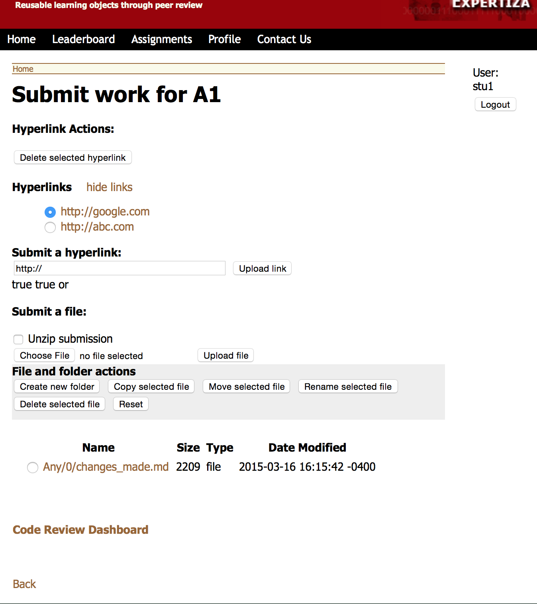
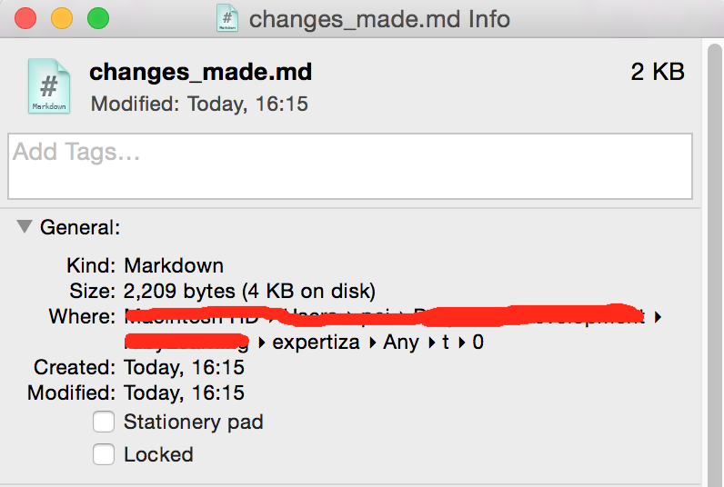

## Demo Video

We offer a short demo video demonstrating what we have done for you if you think it is too troublesome to figure them out.
The demo video (1:40) is on [Youtube](https://youtu.be/HgmUJqDzhGc)

## Running Server

This branch is running on: [My Amazon EC2 Instance](http://ec2-52-10-80-197.us-west-2.compute.amazonaws.com:3000)

Credientials:

Role | Username | Password
--- | --- | ---
admin | admin | whatever you like(login auth is disabled)  
student | stu1 | whatever you like(login auth is disabled)  
student | stu2 | whatever you like(login auth is disabled)  
instructor | pro1 | whatever you like(login auth is disabled)

## Changes made:

#### For Bug [#483](https://github.com/expertiza/expertiza/issues/483) fixing

1. In `submitted_content_controller.rb`, line 19. Changed `else if` to `elsif`
2. In `model/assignment.rb`, line 489. Changed `Course.find(self.course_id).get_path` to `Course.find(self.course_id).directory_path`
3. In `submitted_content/_main.html.erb`. Changed `:participant_id => assignment_participant.id` to `:participant_id => participant.id`
4. In `config/routes.rb`. Added one more routes `post :submit_file`

#### Refactoring review_files_controller
1. Changed `and` and `or` to `&&` and `||`.
2. In `def get_comments`, deleted unused variable: `newobj =  ReviewComment.where(review_file_id: params[:file_id]);`
3. In `def show_all_submitted_files`, deleted unused variable: `file_path = ReviewFile.get_file(code_review_dir, versions.sort.last,base_filename)`
4. In `def show_all_submitted_files`, deleted unused variable: `code_review_dir = ReviewFilesHelper::get_code_review_file_dir(AssignmentParticipant.find(auth[base_filename][versions.sort.last]))`
5. In `review_comments_helper.rb`, created a new method: `def self.populate_comments`, which helps to 
6. Rewrited all `:key => value` to `key: value` format
7. In `review_files_helper.rb`, created a new method: `def self.populate_processor`, which contains some statements in `def show_code_files_diff`.
8. In `review_files_helper.rb`, created a new method: `def self.find_review_files`, which contains some statements in `def show_all_submitted_files`.
9. In `review_files_helper.rb`, created a new method: `def self.find_review_versions`, which contains some statements in `def show_all_submitted_files`.

#### Refactoring submitted_content_controller
1. Changed all `and` and `or` to `&&` and `||`.
2. Rewrited all `:key => value` to `key: value` format
3. Rewrited all `param['string']` to `params[:string]`
4. Added one more routes `post :folder_action` to `config/routes.rb`
5. Changed all `array.size == 0` to `array.zero?`
6. Changed all `find_by_x(val)` and `where("x=val")` to `where(x: val)`
7. In `assignment_participant.rb` line 526, Changed `if all({conditions: ['user_id=? && parent_id=?', user.id, id]}).size == 0` to `if AssignmentParticipant.where(user_id: user.id, parent_id: id).zero?`

#### Results Screenshot

#### RSpec Tests
1. [assignment.rb](spec/lib/assignment_spec.rb)
2. [assignment_participant.rb](spec/lib/assignment_participant_spec.rb)